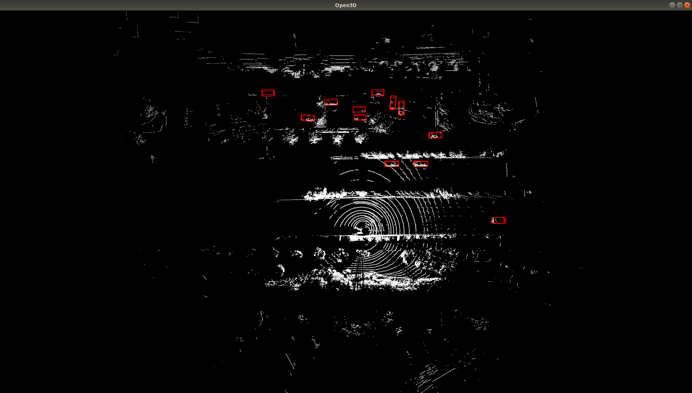
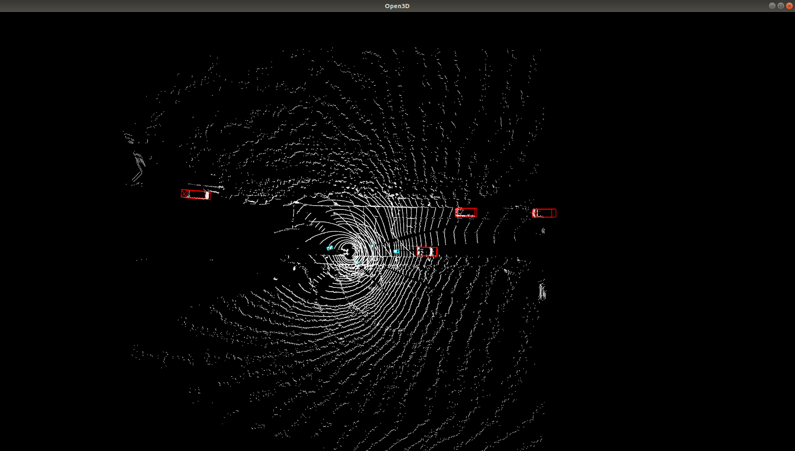

# DSVT模型预研报告

Cerated by ZhengHu on 12/27/2023

## 数据集

本报告实验基于zhito_dataset 环卫 5W帧数据集。

## 网络结构

## 训练方式

因为是一阶段模型，根据上传配置档直接train就好

## 模型指标

### 性能指标

能指标记录为AP/Precision/Recall（平均精度/准确率/召回率）
指标评估基于同一测试集，训练300epoch，评估时的分数阈值为0.2

#### baseline vs dsvt模型指标

本表格对比baseline模型（cnnseg）和最终优化之后dsvt模型的性能指标，相较于之baseline模型，dsvt模型整体指标有了明显提升；黑色粗体表示ap指标变化范围，特别是小物体提升显著，unknown提升24个点，pedestrian提升10个点左右。

| item       | baselin        | dsvt                      | train range                               | eva range                     |
| ---------- | -------------- | ------------------------- | ----------------------------------------- | ----------------------------- |
| vehicle    | 89.9/95.9/90.4 | 94.6/95.1/93.0(**+4.7**)  | [-61.44, -42.24, -5.0, 61.44, 42.24, 5.0] | [-61, -40, -5.0, 61, 40, 5.0] |
| pedestrian | 62.8/89.6/66.4 | 83.5/82.0/86.0(**+10.7**) | [-61.44, -42.24, -5.0, 61.44, 42.24, 5.0] | [-61, -40, -5.0, 61, 40, 5.0] |
| cyclist    | 76.7/93.8/77.7 | 83.1/87.7/84.5(**+6.4**)  | [-61.44, -42.24, -5.0, 61.44, 42.24, 5.0] | [-61, -40, -5.0, 61, 40, 5.0] |
| unknown    | 56.1/87.8/59.1 | 80.1/83.8/81.5(**+24.0**) | [-61.44, -42.24, -5.0, 61.44, 42.24, 5.0] | [-61, -40, -5.0, 61, 40, 5.0] |
| truck      | 89.4/93.8/90.3 | 92.1/91.6/92.6(**+2.7**)  | [-61.44, -42.24, -5.0, 61.44, 42.24, 5.0] | [-61, -40, -5.0, 61, 40, 5.0] |
| tram       | 81.4/92.3/82.1 | 88.0/89.0/89.1(**+6.6**)  | [-61.44, -42.24, -5.0, 61.44, 42.24, 5.0] | [-61, -40, -5.0, 61, 40, 5.0] |
| car        | 89.3/95.2/89.7 | 94.1/94.5/92.7(**+4.8**)  | [-61.44, -42.24, -5.0, 61.44, 42.24, 5.0] | [-61, -40, -5.0, 61, 40, 5.0] |

## 模型部署

#### 部署方式

根据上图模型网络结构，需要将模型拆解为各子模块进行部署，如下表所示为各子模块详细列表及部署方式。

| item             | method   |
| ---------------- | -------- |
| dynamic vfe      | onnx文件 |
| dsvt_input_layer | cuda     |
| pos_embedding    | onnx文件 |
| dsvt_blocks      | onnx文件 |
| scatter          | cuda     |
| 2D backbone+head | onnx文件 |
| postprocess      | cuda     |

#### dsvt模型耗时测试

分别基于不同平台：本地、服务器、嵌入式进行测试，本地P4000总体耗时100ms左右，服务器RTX 2080Ti总体耗时19ms左右，嵌入式平台orin测试总体耗时58ms左右；具体如下。

|                  | P4000        | RTX 2080Ti    | Orin          |
| ---------------- | ------------ | ------------- | ------------- |
| **total**        | **0.100122** | **0.0197122** | **0.0588377** |
| preprocess       | 0.000521054  | 0.00043931    | 0.00110837    |
| dynamic vfe      | 0.0127015    | 0.00419766    | 0.00965583    |
| dsvt_input_layer | 0.0116133    | 0.0072222     | 0.00609343    |
| pos_embedding    | 0.00175029   | 0.000349375   | 0.00098726    |
| dsvt_blocks      | 0.0501906    | 0.00393796    | 0.0283472     |
| scatter          | 0.000421949  | 0.000141433   | 0.000802003   |
| rpn              | 0.0220243    | 0.00243368    | 0.0104529     |
| postprocess      | 0.000899035  | 0.000990536   | 0.0013908     |

#### python & C++结果可视化

对比两者结果，结果基本一致性。

| python                                                       | C++                                                          |
| ------------------------------------------------------------ | ------------------------------------------------------------ |
|  |  |
|  |  |
|  |  |
|  |  |
|  |  |
|                                                              |                                                              |

